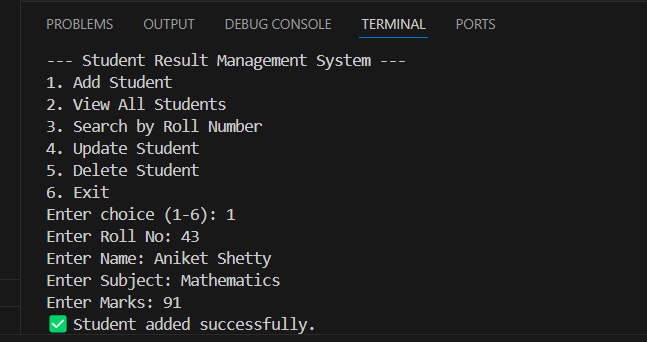

# 🎓 Student Result Management System

A CLI-based Python project to manage student academic records using SQLite.

---

## ✨ Features

- Add new student records
- View all records
- Search student by Roll Number
- Update student result
- Delete student record
- Uses SQLite as a lightweight local database

---

## 🛠️ Tech Stack

- **Language:** Python 3
- **Database:** SQLite (via sqlite3 module)
- **Platform:** Command-Line Interface

---

## 🚀 How to Run
## 📸 Screenshot



```bash
python main.py
